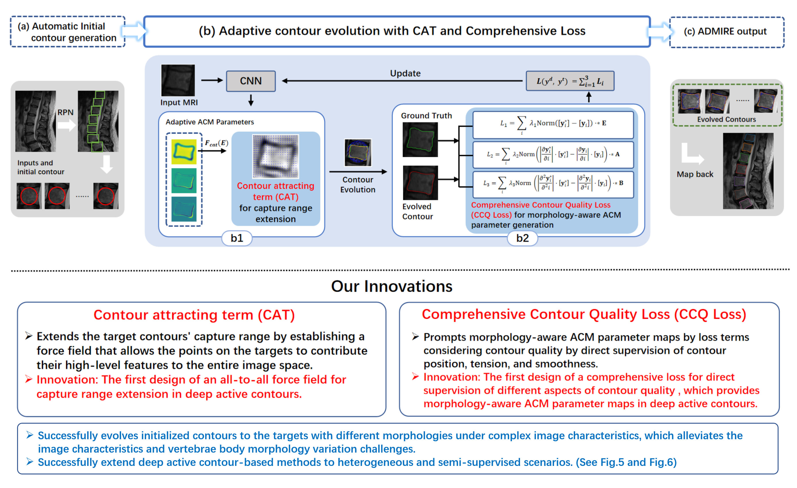

## ADMIRE

Official code repository for Medical Image Analysis paper "Attractive deep morphology-aware active contour network for vertebral body contour extraction with extensions to heterogeneous and semi-supervised scenarios" by Shen Zhao, Jinhong Wang, Xinxin Wang, Yikang Wang et al.

### Introduction

Attractive Deep Morphology-aware actIve contouR nEtwork (ADMIRE) is a novel network that embeds an elaborated contour attraction term (CAT) and a comprehensive contour quality (CCQ) loss into the deep ACM-based framework to conduct Automatic vertebral body contour extraction (AVBCE). The CAT adaptively extends the target contours’ capture range by designing an all-to-all force field to enable the target contours’ energy to contribute to farther locations. Furthermore, the CCQ loss is carefully designed to generate morphology-aware active contour parameters by simultaneously supervising the contour shape, tension, and smoothness.



(This figure displays the structure of fully-supervised ADMIRE, please refer to our paper for semi-supervised ones)

ADMIRE shows great accuracy, robustness, and generalization ability on multiple spinal and cardiac dataset evaluated, and is able to cooperate well with semi-supervised strategies such as mean teacher, which enables its function in semi-supervised scenarios. 

### Guide to run ADMIRE

#### Data preparation

ADMIRE supports two data loading modes: folder mode and npy mode. Folder mode loads *.jpg in one folder and automatically preprocesses them. Original images should be named after image\_[id].jpg and masks should be named after mask\_[id].jpg. IDs should be corresponded, and masks are expected to be continuous. NPY mode is recommended for it saves a lot of time from preprocessing the images. A pair of npy files are needed, for example, ADM_images_128.npy and ADM_contour_200.npy. The image numpy file array is in the shape of [image_width, image_height, 3(image_channels), image_num], and the contour numpy file array is in the shape of [contour_point_num, 2, image_num]. It's suggested you preprocess and pack the data in advance of running ADMIRE code.

#### Environment requirements

ADMIRE requires pytorch-gpu. The code is tested on both torch-1.10.1 and torch-1.11.1 with CUDA 11.3 and may run on other versions.

For other environment requirements, please install them using:

```shell
pip install -r requirements.txt
```

#### Setting up parameters and start evaluating

There are five python files(*.py) that you can use for training and evaluating ADMIRE.

```
 - train_single.py: training on single dataset
 - train_multiple.py: training on mixed datasets
 - train_dsbn_mskt.py: training on mixed dataset using DSBN and MSKT strategy (not applicable for single dataset)
 - train_mt.py: conduct semi-supervised training using mean teacher strategy on single dataset
 - train_psmt.py: conduct semi-supervised training using pertubed and strict mean teacher strategy on single dataset
```

Each python file have its unique corresponding config file in the config folder, for example train_single.py have config/train_single.py. For detailed explanation of each parameter's meaning and function, please refer to the annotation in the config pys.

The program creates ./checkpoints and ./results to store result files by default, if you are making parallel training, please modify the store direction in the config pys as well.

If you want pure evaluation, please change the do_train param to False, as well as making the epochs param to one more than the loaded weight's epoch num.

### Pretrained weights

Due to data privacy factors, we are unable to provide MR_AVBCE dataset. However, we do provide pretrained weights on all datasets, and for the key comparative experiments such as mt/psmt on MR_AVBCE.

[The weights would soon be available on Google Drive and 123pan]